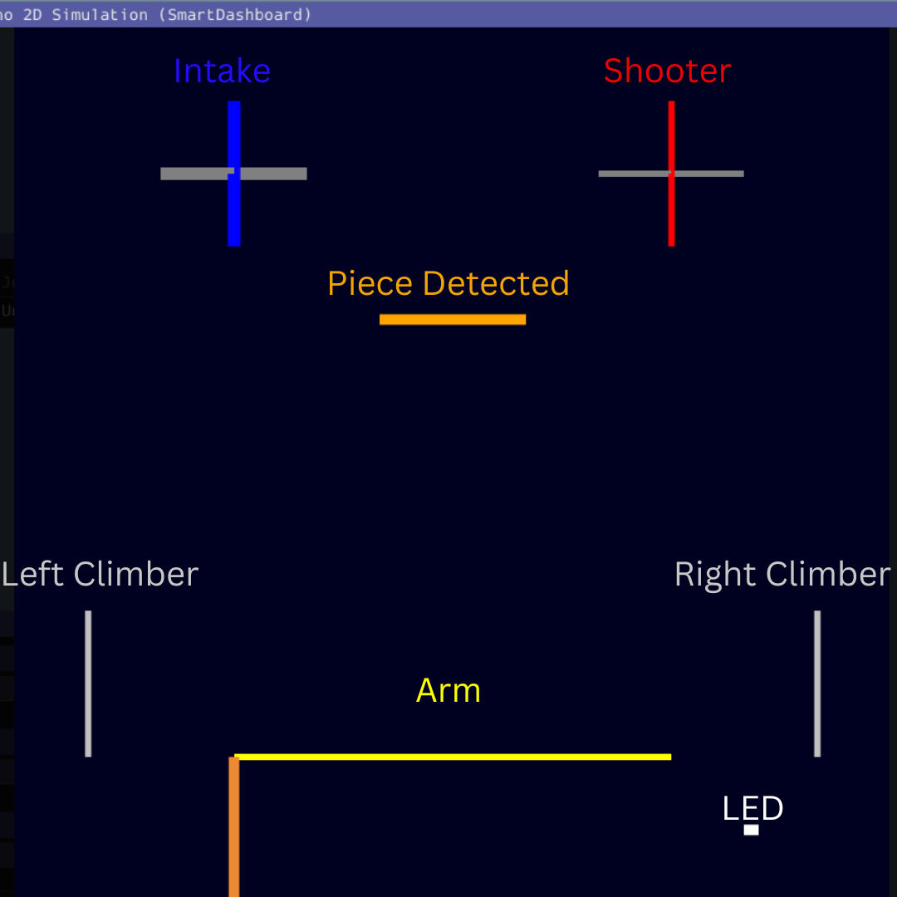

This is the top-level folder for the DevilBotz robot code

The code uses Java WPILib.

# Goals/Features
* Extensibility and Reusability
   * One code base, multiple robots
* Debuggability
   * Logging
   * Simulation
* Vision Based Odometry
* Odometry-based Path Following

# General Resources:
* [WPILib Documentation](https://docs.wpilib.org/en/stable/)
* [DevilBotz 2876 Standard Laptop Configuration](https://docs.google.com/document/d/1NRJyu0b7zgzJpNy1R-b7AjI3fnhwZ_R6fZo0EVbo2pM)
* [FRC Programming in WPILib](https://youtube.com/playlist?list=PL4GNHenJg9JD5xdRxByaZZEZP1PPajPeV&si=1dgx1ZFQP8GEq4w_)
* [Git Tutorial](https://learngitbranching.js.org/)
* [Java Tutorial](https://youtube.com/playlist?list=PLZPZq0r_RZOMhCAyywfnYLlrjiVOkdAI1&si=ImrjG_c4-wThJqy3)

# Getting Started
1. Install [WPILib](https://docs.wpilib.org/en/stable/docs/zero-to-robot/step-2/index.html)
1. Install Git
    1. Windows
    1. MacOS
1. Get Code from GitHub
    1. Create GitHub Account (if you don't already have one)
    1. Start WPILib VSCode
    1. Clone Repository
    1. Login to GitHub Account (if prompted)
    1. Repo: https://github.com/DevilBotz2876/Crescendo2024
      * Note: The initial compilation will take a while because of all the dependencies that need to be downloaded. If all works well, in the Terminal view at the bottom, you should see:
1. Simulating the Code
   1. Starting a Simulation
      * "F5" starts the simulation
         * Alternate Steps:
            * "Ctrl-Shift-P" or "Command-Shift-P"
            * "Simulate Robot Code"
      * Enable: "Sim GUI"
         * If you get the following error: "cannot find frc.robot.main", then:
            * "Ctrl-Shift-P" --> "Clean Language Server Workspace"
      * Optional: Enable DriverStation to better mimic real world usage
   1. Robot Simulation (aka Sim GUI) Overview
      1. Configure XBox Controller
         1. Make sure joystick is in "X-Box Mode". Plug in Joystick.
         1. Verify Joystick is Detected in "System Joysticks" window
            1. On Mac OS: You must connect via a bluetooth wireless enabled controller
         1. Drag controller from "Systeddm Joysticks" to "Joysticks" (Joystick[0])
         1. Make sure to "Map Gamepad" is checked
      1. Open 2D Field View
         1. NetworkTables --> "SmartDashboard" --> "Field"
         1. To Hide Swerve Modules:
            1. Click on the "Hamburger Button"
            1. Goto "XModules"
               * Box/Image --> Hidden
               * Arrow Size --> 10% (slider)
      1. Set Robot State
         1. Set Mode to "Teleoperated"
         1. Thumb Controls should now move the robot
   1. 2D Mechanism Simulation
      1. NetworkTables --> "SmartDashboard" --> "Inferno 2D Simulation"
         
         * Shooter (Blue/Grey)
         * Intake (Red/Grey)
         * Note (Orange)
         * Arm (Yellow/Orange)
         * Climber (Grey)
         * LED (Bottom right box)
   1. Vision Field
       1.  NetworkTables --> "SmartDashboard" --> "VisionSystemSim-main" --> Sim Field
   1. Alliance Selection
   1. Autonomous
   1. AdvantageScope

# Directory Structure
* [src/main](src/main): All of the robot code and config files are here
* [vendordeps](vendordeps): Contains the various external libraries and versions that the code base utilizes.
* [.github/workflows](.github/workflows): Contains various GitHub automation scripts that are run automatically at various stages of the code development/integration process.

# Deploy
Config files, resources, etc that need to be stored directly on the actual robot.  These can be read using standard Java File I/O calls

# Config
The config directory is used to support multiple robot versions using the same code base.

# Useful Resources:
* [Crescendo 2024 Main Electrical Components](https://docs.google.com/spreadsheets/d/1jhis3_a5TAV7oP3p6C41bP5yMevQPRnBtGeEiesHzKM)
* [Crescendo 2024 Hardware/Software Calibration](https://docs.google.com/document/d/1msJO2dKCxqzbMlSSOtfs8W_ITjltEbtXaQBxc-CpNMo)


# 2024
We had 3 different robots with different capabilities for dev/testing purposes:

1. Sherman: Tank Drive + Initial Arm Prototype
2. Phoenix: Initial Swerve Drive + Vision Prototype
3. Inferno: Final Robot

A [RobotConfig](RobotConfig.java) class defines all of the subsystems and corresponding constants required for a "robot". Each robot variant extends RobotConfig and instantiates the subsystems and overrides constants as needed.

| Robot | [Drive](../subsystems/drive/) | [Shooter](../subsystems/shooter/) | [Intake](../subsystems/intake/) | [Arm](../subsystems/arm/) | [Auto](../../../../deploy/pathplanner/) | [Climber](../subsystems/climber/) | [Vision](../subsystems/vision/) | [LED](../subsystems/led/) |
| --- | --- | --- | --- | --- | --- | --- | --- | --- |
| [Sherman](RobotConfigSherman.java) | Differential | SparkMax(2) | SparkMax(1) | TalonSRX(3) | No (stub) | No (stub) | No (stub) | No (stub) | No (stub) |
| [Phoenix](RobotConfigPhoenix.java) | Swerve(yagsl) | No (stub) | No (stub) | No (stub) | Yes | No (stub) | Shooter | No (stub) |
| [Inferno](RobotConfigInferno.java) | Swerve(yagsl) | SparkMax(2) | SparkMax(3) | SparkMax(4) | Yes | SparkMax(7) SparkMax(6) | Shooter Intake Right Left | Yes |


# Subsystems
Subsystem and IO interfaces and implementations

Subsystemts utilize the [AdvantageKit IO Layer](https://github.com/Mechanical-Advantage/AdvantageKit/blob/main/docs/RECORDING-INPUTS.md) paradigm.


Each subsystem is implemented using the following breakdown.  Here, assume we have a mechanism called a "Gizmo":
* Hardware IO
   * _Simple_ Interface (defines the desired _hardware_ functionality)
      * Gizmo*IO*.java
        ```
        public static class GizmoIOInputs {
            public double velocityRadPerSec = 0.0;
            public double appliedVolts = 0.0;
            public double current;
        }

        void updateInputs(GizmoIOInputs inputs); ← gets current sensor readings

        void setVoltage(double volts); ← sets desired voltage
        ```
   * One _or more_ Implementation(s)
      * GizmoIO*Stub*.java ← Simulated implementation
        ```
        public class GizmoIOStub implements GizmoIO {
        ```
      * GizmoIO*SparkMax*.java ← SparkMax motor based implementation
      * GizmoIO*Etc*.java
* Subsystem (utilizes one or more Hardware IO implementation)
   * _Single_ Interface (defines the desired _subsystem_ functionality)
      * Gizmo*Subsystem*.java
        * Low Level/Debug Controls
            ```
            void runVoltage(double volts);
            double getCurrentVoltage();
            void add2dSim(Mechanism2d mech2d);
            ```
        * High Level Controls
            ```
            Command getTurnOffCommand();
            Command getTurnOnCommand();
            ```
   * One _or more_ Implementation(s)
      * GizmoSubsystem*Simple*.java
        ```
        public class GizmoSubsystemSimple implements Gizmo {
            GizmoSubsystemSimple(GizmoIO io); ← an IO instance is passed into the GizmoSubsystemSimple

            void periodic() {
                IO.updateInputs(inputs);
                Logger.processInputs("Intake", inputs)
            }
            ...
        }
        ```
      * GizmoSubsystem*Advanced*.java
        ```
        public class GizmoSubsystemAdvanced implements Gizmo {
            ...
        }
        ```
      * GizmoSubsystem*Etc*.java

It is important to note that the *same* Hardware IO can be shared by completely different subsystems.  E.g. we may just want a Hardware IO layer abstraction for basic functionality  E.g.
* MotorIO
   * MotorIOSparkMax
   * MotorIOTalonSRX
* LimitSwitchIO

And then a subsystem can consist of 1 or more MotorIO instances and 1 or more LimitSwitchIO instances.

## Controls
All controls including driver, debug, pit, and sysid are defined here.  This includes both joystick and GUI-based controls.
# Useful Resources:
* [Crescendo 2024 Driver Controls](https://docs.google.com/document/d/1A22hMpvmXuujwkwF299oZQ94aNbzZQalUD1ifmwRZtk)


# Code Structure
Top-Level location of the robot's actual source code

This code based uses the [WPILib command-based](https://docs.wpilib.org/en/stable/docs/software/commandbased/index.html) programming paradigm

# Code Flow
1. [Main.java](Main.java) --> [Robot.java](Robot.java) --> [RobotContainer.java](RobotContainer.java)
   1. Setup Robot Config
      * A persistent preference with the key "Robot Name" is hard-coded onto the RoboRio flash memory
      * The "Robot Name" key is read from the RoboRio at start and determines which robot config to load.
   1. Setup Controls (Bindings)
   1. Setup Autonomous

# Directory Structure
* commands\ - all commands are stored here
   * common\ - Common generic commands that only use the subsystem *interfaces*. Can be re-used, as-is, year to year
   * game\
      * gameYYYY\ - E.g. "crescendo2024" - game and/or subsystem specific commands. Generally *cannot* be re-used, as-is, year to year
* config\ - all robot configurations are stored here
   * game\ - game specific robot configurations are stored here
      * gameYYYY\ E.g. "crescendo2024" - game specific robot configurations are stored here
* io\ - generic low-level hardware IO is contained here. Can be re-used, as-is, year to year.
   * interfaces\ - contains all low-level hard IO *interfaces* that abstract basic software contolled electronic components (e.g. motor, limit switch, absolute encoder, etc)
      * xxxIO.java E.g. "MotorIO.java" defines the interface/APIs that *all* motors should implement
   * implementations\ - contains hardware specific IO *implementations*. Likely can be re-used, year to year, but might require updates to match vendor library API changes.
      * xxx\ E.g. "Motor" contains all implementations of the "MotorIO" interface
         * xxxIOStub.java E.g. "MotorIOStub.java" - *Stub* implementations contains software-only implementations intended for software testing/simulation.
         * xxxIOAcme.java E.g. "MotorIOAcme.java" - MotorIO interface implementation for the "Acme" branch of motor/controller.
* subsystems\ - subsystem code is contained here.
   * interfaces\ - contains generic subsystem *interface* definitions. Can be re-used, as-is, year to year. "common" commands should be written to use these interfaces
      * xxx.java - E.g. "Intake.java" - defines the generic subsystem interface for an Intake
   * implementations\ - contains implementations subsystem interfaces
      * xxx\ - Contains the one or more *implementations* of a subsystem
         * xxxSubsystem.java E.g. IntakeSubsystemVersionA
* util (?) - TBD
* controls\ (?) - TBD

# Pathplanner
Path and Auto routine configuration files generated by the PathPlanner App

# Useful Resources:
* [PathPlanner](https://pathplanner.dev/pathplanner-gui.html)
* [Crescendo 2024 Autonomous Routines](https://docs.google.com/document/d/1YG0RpWz_kYT4aMvY1ALhe9GsHA7w0coU_XH6KsEIKpw)

# Yagsl
YAGSL swerve configuration files for each robot

# Useful Resources
* [YAGSL](https://yagsl.gitbook.io/yagsl)
* [Crescendo 2024 Swerve Bring-Up Checklist - Phoenix](https://docs.google.com/document/d/1E4FAC1YTaWKI4XfINkX6v6q33PmBH5FilczPb08y0cg)
* [Crescendo 2024 Swerve Bring-Up Checklist - Inferno](https://docs.google.com/document/d/104QvJt_8DLLTVLK-61OBEZm78WMeOHpgzdBgT3CPT0M)

# Vision
# Useful Resources:
* [PhotonVision](https://docs.photonvision.org/en/latest/)
* [Crescendo 2024 Vision System Design](https://docs.google.com/document/d/1OyC_vcDjkND8d1BjjKcrntKLCYnFIfZ_LF4Lyaiwpdk)

1. Initial Setup
    1. For each camera
        * On the PhotonVision co-processor (e.g.. Raspberry Pi)
            * Assign a unique camera name
            * [2D AprilTag tracking](https://docs.photonvision.org/en/latest/docs/apriltag-pipelines/2D-tracking-tuning.html) will work out of the box
                * You can get camera relative yaw, pitch, and roll information for each visible/detected AprilTag w/o calibrating the camera
            * [3D AprilTag tracking](https://docs.photonvision.org/en/latest/docs/apriltag-pipelines/3D-tracking.html) requires calibration for each resolution:
                * [Calibrate](https://docs.photonvision.org/en/latest/docs/calibration/calibration.html) FOV
                * Measure location of camera relative to the center of the robot (See Transform3D [VisionCamera.VisionCamera](./VisionCamera.java))
                    * Measure translation (x,y,z)
                    * Measure rotation (roll, pitch, yaw)
    1. For each field
        * Load the AprilTag map layout into PhotonVision (See AprilTagFields.class)
2. Periodically at runtime
    1. For each camera
        * If estimated robot pose is available (i.e. AprilTag is visible and 3D tracking is enabled)
            * addVisionMeasurement to drivetrain odometry (See [Drive.addVisionMeasurement()](../drive/Drive.java))
